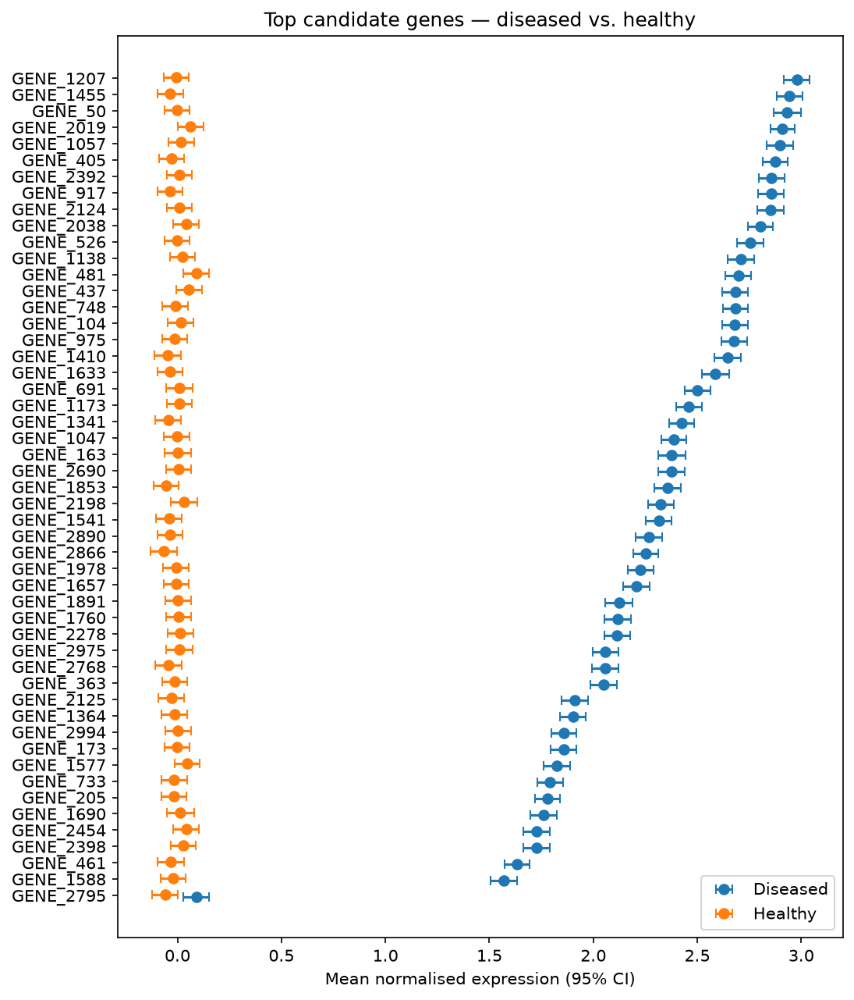

# Disease Gene Expression Analysis

Statistical analysis of a 3000-gene expression dataset to identify genes
associated with disease status, using Python and standard statistical methods.

## Overview

This project analyzes gene expression data from diseased and healthy
patients. For each of 3000 genes, I computed descriptive statistics
(mean, variance, 95% confidence intervals) and tested for differential
expression between groups using two-sample t-tests. To control for
false positives across 3000 simultaneous tests, I applied
Benjamini-Hochberg FDR correction.

## Dataset

- Source: [Kaggle | https://www.kaggle.com/datasets/meruvakodandasuraj/gene-expression-dataset-for-disease-classification/data#1]
- 3000 genes × 2000 patients
- Two groups: diseased and healthy

## Methods

1. **Data cleaning** — checked for missing values and duplicates
2. **Descriptive statistics** — mean, variance, 95% CI per gene
3. **Differential expression** — two-sample t-test per gene
4. **Multiple-testing correction** — Benjamini-Hochberg FDR
5. **Candidate filtering** — FDR-adjusted p < 0.05 and non-overlapping CIs
6. **Visualization** — forest plot

## Results

- 51 genes with significant differential expression (FDR < 0.05, non-overlapping CIs)
- Top candidates visualized in forest plot (see below)
- One gene flagged as marginal effect size (see print in Jupyter)
- Only gene overexpression found, underexpression also expected but not found

## Tools

Python: pandas, NumPy, SciPy, statsmodels, matplotlib, seaborn, Jupyter

## How to Run

1. Download the dataset from the link above
2. Place 'gene_expression_disease_classification.csv' in the project folder
3. 'pip install -r requirements.txt'
4. Open 'gene_expression_analysis.ipynb' in Jupyter and run all cells
